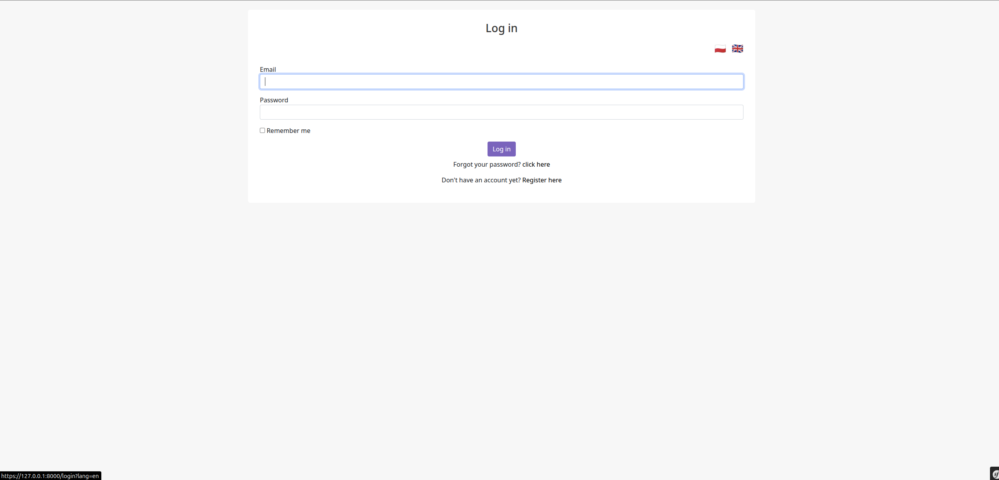
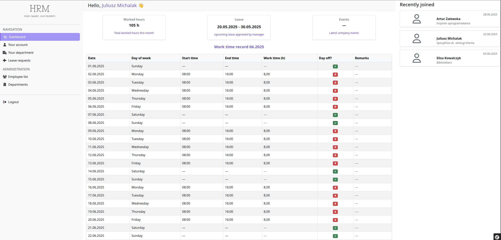
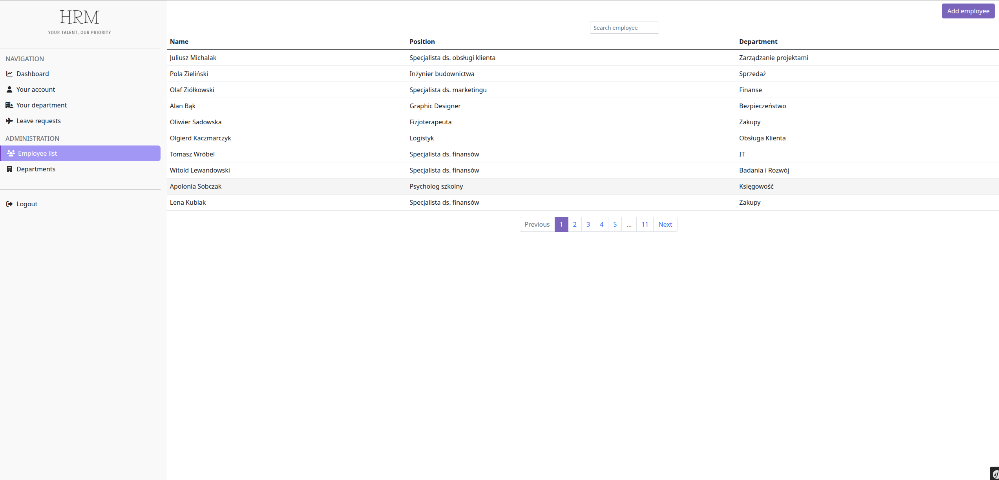
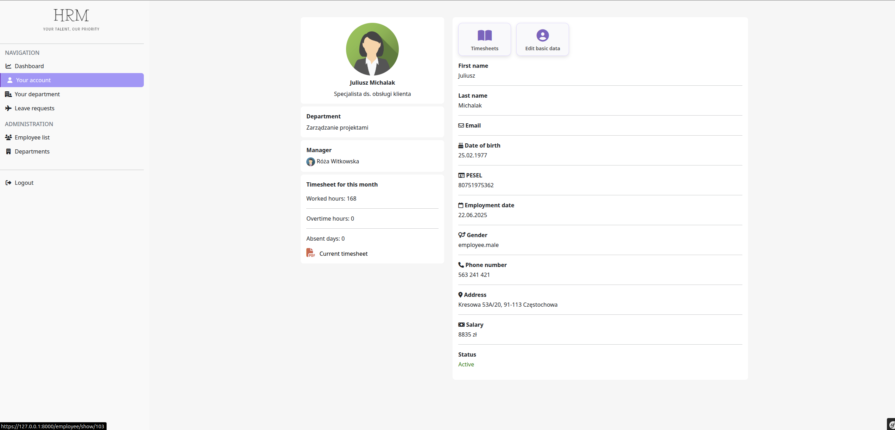
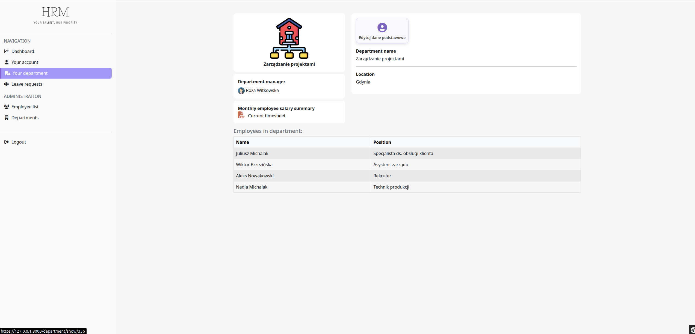
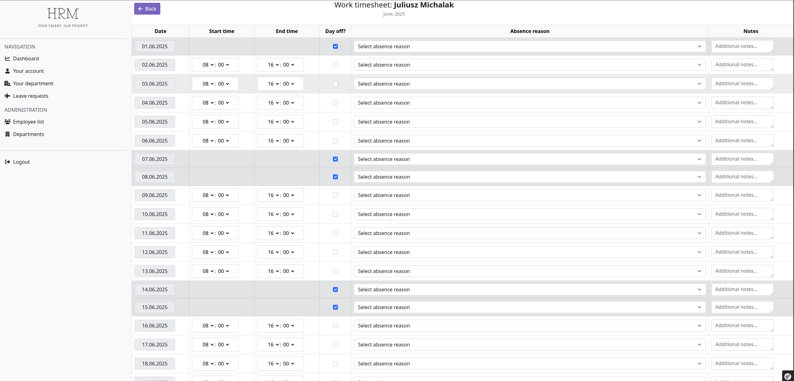
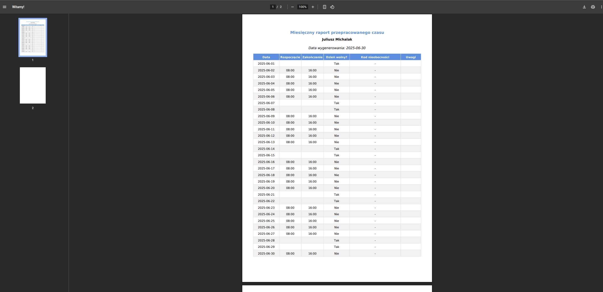
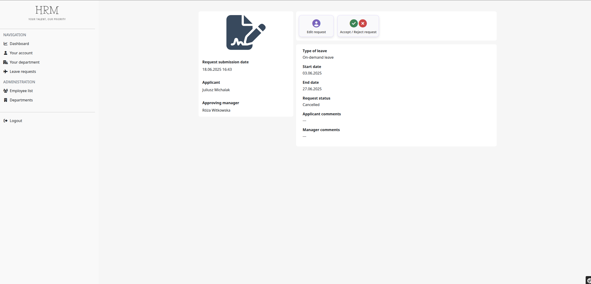

# Human Resource Management (HRM)

## 🇵🇱 Wersja polska (English version below)

Aplikacja webowa do zarządzania zasobami ludzkimi, napisana w PHP 8.3 i Symfony 7.2.2.

---

## Spis treści
- [Technologie](#technologie)  
- [Funkcjonalności](#funkcjonalności)  
- [Prezentacja](#przezentacja)
- [Instalacja i konfiguracja](#instalacja-i-konfiguracja)  
- [Kontakt](#kontakt)  
- [Licencja](#licencja)  

---

## Technologie

- PHP 8.3  
- Symfony 7.2.2  
- RabbitMQ 
- Doctrine ORM  
- Twig 
- Bootstrap 5 
- HTML5
- CSS3


## Funkcjonalności

- Zarządzanie pracownikami 
- Zarządzanie działami  
- Ewidencja czasu pracy  
- Moduł wniosków urlopowych  
- Wielojęzyczność (PL/EN) z wyborem języka przez użytkownika  
- Asynchroniczne przetwarzanie zadań z RabbitMQ - wysyłka maili
- Generowanie raportów: miesięczna ewidencja czasu pracy pracownika, miesięczne podsumowanie przepracowanego czasu przez pracowników dla każdego działu


## Prezentacja

Poniżej znajdują się przykładowe zrzuty ekranu przedstawiające kluczowe funkcje aplikacji Human Resource Management.

### Ekran logowania


### Dashboard


### Lista pracowników


### Szczegóły pracownika


### Oddział


### Ewidencja czasu pracy


### Miesięczny raport pracy pracownika


### Wniosek urlopowy


### Wymagania

- PHP 8.3  
- Composer  
- Symfony CLI 
- RabbitMQ Server  
- Serwer bazy danych MySQL
- Symfony Mailer

## Instalacja i konfiguracja
Musisz mieć skonfigurowany i zainstalowany rabbitmq-server.
Na Ubuntu:

```bash
git clone https://github.com/hightt/HRM
composer install
npm ci
npm run prod

W pliku .env zmodyfikuj następujące parametry:
- DATABASE_URL
- MAILER_DSN
- MESSENGER_TRANSPORT_DSN
- MAILER_FROM_ADDRESS
```

## Licencja

Projekt Human Resource Management jest udostępniony na licencji **MIT**.

Oznacza to, że masz prawo do:

- korzystania z kodu,
- jego modyfikowania,
- rozpowszechniania.

Pod warunkiem, że zachowasz informacje o autorach oraz dołączysz kopię licencji MIT.

Pełny tekst licencji MIT znajdziesz tutaj:  
[https://opensource.org/licenses/MIT](https://opensource.org/licenses/MIT)


## 🇬🇧 English version

# Human Resource Management Web Application built with PHP 8.3 and Symfony 7.2.2

---

## Table of Contents
- [Technologies](#technologies)  
- [Features](#features)  
- [Screenshots](#screenshots)  
- [Installation and Configuration](#installation-and-configuration)  
- [License](#license)  

---

## Technologies

- PHP 8.3  
- Symfony 7.2.2  
- RabbitMQ  
- Doctrine ORM  
- Twig  
- Bootstrap 5  
- HTML5  
- CSS3  

---

## Features

- Employee management  
- Department management  
- Time tracking  
- Leave request module  
- Multilingual support (PL/EN) with user language selection  
- Asynchronous task processing with RabbitMQ – email sending  
- Report generation: monthly employee timesheets, monthly department work time summaries  

---

## Screenshots

Below are sample screenshots showcasing key features of the Human Resource Management application.

### Login Screen  


### Dashboard  


### Employee List  


### Employee Details  


### Department Details  


### Time Tracking Form  


### Monthly Employee Report  


### Leave Request  


---

## Installation and Configuration

Make sure you have RabbitMQ server installed and configured.

On Ubuntu:

```bash
git clone https://github.com/hightt/HRM
composer install
npm ci
npm run prod
```

## License

The Human Resource Management project is licensed under the **MIT License**.

This means you are allowed to:

- use the code,  
- modify it,  
- distribute it.

Provided that you retain the author information and include a copy of the MIT License.

You can find the full text of the MIT License here:  
[https://opensource.org/licenses/MIT](https://opensource.org/licenses/MIT)
